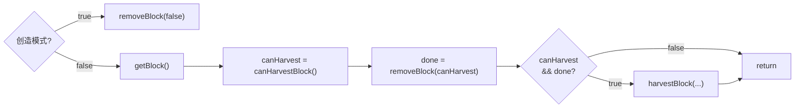
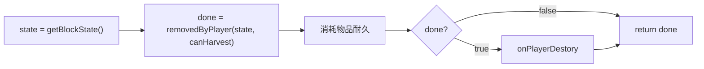

# Minecraft 睡前废话（一）—— 掉落物与方块：从撸树开始的故事

*警告：本教程废话连篇，请酌情跳过*

## Registry与搞事情的Mojang，论屎山是如何形成的

### 如何从一个方块获取对应的物品

史蒂夫进入了游戏，史蒂夫抡起了他的铁手，好！史蒂夫成功的挖下来一块木头！

现在我们需要获取这块木头对应的物品，嗯，很简单

```java
ItemsStack item = new ItemStack(block);
```

~~好，非常完美.jpg，今天的教程就到这里了，我们下次再见。~~

那么我们就从这里触发，扒开mojang的源码，很轻松的找到了它的它的核心实现：

```java
Item item = Item.getItemFromBlock(blockIn);
```

在1.16.5里面，`Block`类实现了一共`IItemProvider`接口，理论上给我们更多的操作空间（比如不用`ItemBlock`注册对应的物品）但是显然重写这个方法非常的不明智。

```java
public Item asItem() {
    if (this.item == null) {
        this.item = Item.getItemFromBlock(this);
    }
    return this.item.delegate.get(); //Forge: Vanilla caches the items, update with registry replacements.
}
```

继续查看`getItemFromBlock`方法的实现，发现它最终是从`BLOCK_TO_ITEM`这个Map里面获取值的，显然，这个Map是和Registry相关了。那么我们刨根问底，看看这个Map到底是怎么被创建的。

### N种注册方块的方式

在这之前，让我们先回忆一下如何去注册一个方块。

注册方块，诸多小伙伴开发mod的第一步，众多模组也再这方面大显神通，对方块的注册各种封装。就像下面这样：

*~~感受一下就好了不需要仔细看，毕竟这不是我们的重点，建议直接划过去~~*

* AE2    

```java
this.controller = registry.block( "controller", BlockController::new )
        .features( AEFeature.CHANNELS )
        .tileEntity( new TileEntityDefinition( TileController.class ) )
        .useCustomItemModel()
        .rendering( new ControllerRendering() )
        .build();
this.drive = registry.block( "drive", BlockDrive::new )
        .features( AEFeature.STORAGE_CELLS, AEFeature.ME_DRIVE )
        .tileEntity( new TileEntityDefinition( TileDrive.class ) )
        .useCustomItemModel()
        .rendering( new DriveRendering() )
        .build();
```

* RFTools

```java
builderBlock = ModBlocks.builderFactory.<BuilderTileEntity> builder("builder")
        .tileEntityClass(BuilderTileEntity.class)
        .container(BuilderTileEntity.CONTAINER_FACTORY)
        .flags(BlockFlags.REDSTONE_CHECK)
        .rotationType(BaseBlock.RotationType.HORIZROTATION)
        .moduleSupport(BuilderTileEntity.MODULE_SUPPORT)
        .guiId(GuiProxy.GUI_BUILDER)
        .infusable()
        .info("message.rftools.shiftmessage")
        .infoExtended("message.rftools.builder")
        .build();
composerBlock = ModBlocks.builderFactory.<ComposerTileEntity> builder("composer")
    .tileEntityClass(ComposerTileEntity.class)
        .container(ComposerTileEntity.CONTAINER_FACTORY)
        .guiId(GuiProxy.GUI_COMPOSER)
        .info("message.rftools.shiftmessage")
        .infoExtended("message.rftools.composer")
        .build();
```

* Create

```java
public static final BlockEntry<MinecartAnchorBlock> MINECART_ANCHOR =
    REGISTRATE.block("minecart_anchor", MinecartAnchorBlock::new)
        .initialProperties(SharedProperties::stone)
        .blockstate((c, p) -> p.simpleBlock(c.get(), p.models()
            .getExistingFile(p.modLoc("block/cart_assembler/" + c.getName()))))
        .register();

public static final BlockEntry<LinearChassisBlock> LINEAR_CHASSIS =
    REGISTRATE.block("linear_chassis", LinearChassisBlock::new)
        .initialProperties(SharedProperties::wooden)
        .tag(AllBlockTags.SAFE_NBT.tag)
        .blockstate(BlockStateGen.linearChassis())
        .onRegister(connectedTextures(new ChassisCTBehaviour()))
        .lang("Linear Chassis")
        .simpleItem()
        .register();
```

    

当然也有朴素版本的

* Thermal Foundation

```java
//TFBlocks.java - preInit()
blockOre = new BlockOre();
blockOreFluid = new BlockOreFluid();
blockStorage = new BlockStorage();
//......
initList.add(blockOre);
initList.add(blockOreFluid);
initList.add(blockStorage);
for (IInitializer init : initList) {
    init.preInit();
}

//BlockStorage.java - preInit()
this.setRegistryName("storage");
ForgeRegistries.BLOCKS.register(this);
ItemBlockCore itemBlock = new ItemBlockCore(this);
itemBlock.setRegistryName(this.getRegistryName());
ForgeRegistries.ITEMS.register(itemBlock);

blockCopper = new ItemStack(this, 1, Type.COPPER.getMetadata());
blockTin = new ItemStack(this, 1, Type.TIN.getMetadata());
blockSilver = new ItemStack(this, 1, Type.SILVER.getMetadata());
//......

registerWithHandlers("blockCopper", blockCopper);
registerWithHandlers("blockTin", blockTin);
registerWithHandlers("blockSilver", blockSilver);
//.....
```

* Botaina

```java
public static final Block flower = new BlockModFlower();
public static final Block altar = new BlockAltar();
public static final Block livingrock = new BlockLivingrock();
@SubscribeEvent
public static void registerBlocks(RegistryEvent.Register<Block> evt) {
    IForgeRegistry<Block> r = evt.getRegistry();
    r.register(flower);
    r.register(altar);
    r.register(livingrock);
}
@SubscribeEvent
public static void registerItemBlocks(RegistryEvent.Register<Item> evt) {
    IForgeRegistry<Item> r = evt.getRegistry();
    r.register(new ItemBlockWithMetadataAndName(flower).setRegistryName(flower.getRegistryName()));
    r.register(new ItemBlockWithMetadataAndName(altar).setRegistryName(altar.getRegistryName()));
    r.register(new ItemBlockWithMetadataAndName(livingrock).setRegistryName(livingrock.getRegistryName()));
}
```

当然还有其他更多的写法，感兴趣的可以去详细的研究，然后自己接着造轮子（

### 注册方块的特点

各个模组作者顺着自己的习惯，满足自己的强迫症对注册方块进行了不同程度的封装，但是相同的地方是，每注册一个方块，均会同时注册一个继承自`ItemBlock`的物品，让我们继续再Forge的祖传代码里面寻找，最终我们会发现这样一段代码

```java
//GameData.ItemCallbacks
@Override
public void onAdd(IForgeRegistryInternal<Item> owner, RegistryManager stage, int id, Item item, @Nullable Item oldItem)
{
    if (oldItem instanceof BlockItem)
    {
        @SuppressWarnings("unchecked")
        Map<Block, Item> blockToItem = owner.getSlaveMap(BLOCK_TO_ITEM, Map.class);
        //blockToItem.remove(((ItemBlock)oldItem).getBlock()); //1.12.2 实现
        ((BlockItem)oldItem).removeFromBlockToItemMap(blockToItem, item);
    }
    if (item instanceof BlockItem)
    {
        @SuppressWarnings("unchecked")
        Map<Block, Item> blockToItem = owner.getSlaveMap(BLOCK_TO_ITEM, Map.class);
        //blockToItem.forcePut(((ItemBlock)oldItem).getBlock()); //1.12.2 实现
        ((BlockItem)item).addToBlockToItemMap(blockToItem, item);
    }
}
```

也就是说，每一个被注册的`ItemBlock`(1.12.2是`ItemBlock`)都会在`BLOCK_TO_ITEM`注册上对应的项，也因此，我们能够通过对应的代码来获取方块对应的掉落物。

至此，我们也找到了`BLOCK_TO_ITEM`这个Map创建的地方了。~~（于是你就水了一吨废话！）~~

那么，开头提到的那种方式，适用于所有方块吗？理论上的答案应该是肯定的，但是现实并不是这样，Mojang开始背锅了。

### Mojang背锅，原版床的奇怪特性

让我们试试下面的代码（1.12）

```java
Item bed = Item.getItemFromBlock(Blocks.BED);
```

打断点查看的结果好像有点出乎意料，`bed`的值是`ItemAir`！寻找源代码我们发现，`ItemBed`它并没有继承自`ItemBlock`！同样实现的还有红石粉，它也不是作为ItemBlock注册的

```java
public class ItemRedstone extends Item {}
public class ItemBed extends Item {}
```

有意思的是，原版的`线`却是作为一个ItemBlock来注册的

```java
registerItem(287, "string", (new ItemBlockSpecial(Blocks.TRIPWIRE)).setTranslationKey("string").setCreativeTab(CreativeTabs.MATERIALS));
```

除了床外，只有极少数方块没有对应的物品，例如AE的'线缆'方块，因为它本身是线缆、接口、总线等等的组合方块的实际实现。

在1.16.5的代码中不存在这种情况了，Mojang吧所有可以放置的物品全都注册成了`BlockItem` ，包括但不限于之前说到的床、红石、线等。

```java
//线(1.16)
public static final Item STRING = register("string", new BlockNamedItem(Blocks.TRIPWIRE, (new Item.Properties()).group(ItemGroup.MISC)));
//红石(1.16)
public static final Item REDSTONE = register("redstone", new BlockNamedItem(Blocks.REDSTONE_WIRE, (new Item.Properties()).group(ItemGroup.REDSTONE)));
//床(1.16)
public static final Item WHITE_BED = register(new BedItem(Blocks.WHITE_BED, (new Item.Properties()).maxStackSize(1).group(ItemGroup.DECORATIONS)));
```

也正因为如此，强烈建议将方块对应的物品继承自`BlockItem`

## Metadata与Flattening，Mojang终于干了一件正事

对于什么是meta这个问题我们在这里就不做太多赘述了，感兴趣的小伙伴可以自行去研究一下~

那么为什么还要提这件事呢，因为meta的存在，我们在处理方块和物品对应关系的时候需要进行一些额外的操作~

### 方块的metadata

如果你想更多的了解有关meta的问题，请参考[Harbinger 的教程](https://harbinger.covertdragon.team/chapter-05/block-state.html)， 值得一提的是，在1.12.2中你可以将部分方块的状态存储在TileEntity中并且使用getActualState()进行一些操作，就像下面这样

```java
@Override
public IBlockState getActualState(IBlockState state, IBlockAccess world, BlockPos pos) {
    TileEntity te = world instanceof ChunkCache 
        ? ((ChunkCache) world).getTileEntity(pos, Chunk.EnumCreateEntityType.CHECK) 
        : world.getTileEntity(pos);
    if (te instanceof MyTileEntity) {
        return state.withProperty(STATE, ((MyTileEntity) te).getState());
    }
    return super.getActualState(state, world, pos);
}
```

值得注意的是这里有个ChunkCache的判断，根据注释表明，这样做是为了避免在渲染线程中创建新的TileEntity（一般调用`getTileEntity()`的时候，如果当前位置不存在会尝试创建一个新的），但是实际上，forge已经对ChunkCache的源码有过Hook，至于为什么要这样做，或许是历史遗留吧~

```java
//ChunkCache.java
@Nullable
public TileEntity getTileEntity(BlockPos pos)
{
    return this.getTileEntity(pos, Chunk.EnumCreateEntityType.CHECK); // Forge: don't modify world from other threads
}
```

稍微有点跑题了，总而言之，与meta相关的两个重要方法

- `getStateFromMeta`
- `getMetaFromState`

在我们之后的用例里面会用到这些方法的。

***再次强调，meta的最大值是15***，这也是1.12.2部分代码感觉非常奇怪的原因（木头有两个方块实例，`OldLogBlock`和`NewLogBlock`）

嗯？你问1.16？那么忽略上面提到的所有内容吧，1.13以后的代码我们终于不需要考虑这些有的没的了，耶！

### 物品的metadata

相关的概念同样在[Harbinger 的教程](https://harbinger.covertdragon.team/chapter-04/advanced/meta-hack.html)里已经描述的很清楚了，这里我把它拉出来，主要是像提醒几个问题。

- 1.13以后的版本实质上已经没有物品meta的概念了，它已经只作为一个`Damage`标签保存在NBT中。flattening之后我们已经不需要节省id了所以没有必要使用meta hack，即使真的需要相关操作（动态加载物品等）更好的方案是直接创建一个新的NBT标签。
- 1.12的metadata虽然是个int值，但是因为序列化成nbt时候保存为short所以最大值只能是`Short.MAX_VALUE`。
- 虽然一般情况下我们会直接把方块meta和物品meta直接对应，但是实际上两者并没有严格的关联。

## 从 `getDrops`系列 到 `LootTable`，掉落物方案的统一

### 1.12方块掉落：`getDrops`系列

对于1.12的模组，Forge对Block类进行了一定程度的patch，你可以通过重写下面提到的部分方法来修改方块的掉落物。

- 获取对应的物品`getItemDropped`、`damageDropped`和`getPickBlock`

  我们现在已经知道，可以通过`Item.getItemFromBlock`方法来一定程度的获取方块对应的物品，但是，并不是所有方块的掉落物都是方块对应的物品。例如，煤炭、红石等矿石会掉落物品，草会掉落种子，成熟的作物掉落产品而未成熟的作物掉落的却是种子……

  同时，上面刚刚提到的，方块的meta和物品的meta并不是严格对应的，在定义含有meta的方块时，你也需要指定他们的对应规则。

  - 你可以重写`getItemDropped`方法来修改物品的掉落：*(From: 草方块)*

```java
@Override
public Item getItemDropped(IBlockState state, Random rand, int fortune)
{
    BlockState dirt = Blocks.DIRT.getDefaultState().withProperty(BlockDirt.VARIANT, BlockDirt.DirtType.DIRT);
    return Blocks.DIRT.getItemDropped(dirt, rand, fortune);
}
```

    同时，你可以直接返回`Items.AIR`使其没有掉落物：*(Form: 蛋糕)*

```java
@Override
public Item getItemDropped(IBlockState state, Random rand, int fortune)
{
    retrun Items.AIR;
}
```

    根据自身状态的不同掉落不同的方块，如小麦只有在成熟的时候才掉落作物其余时候掉落种子：*(From: 小麦)*

```java
public Item getItemDropped(IBlockState state, Random rand, int fortune)
{
    return this.isMaxAge(state) ? this.getCrop() : this.getSeed();
}
```

    

  - 如果你的方块使用了meta hack，你**必须**重写`damageDropped`方法。

    通常我们会直接像下面这样写，因为大部分情况下方块和物品meta是对应的：

```java
@Override
public int damageDropped(IBlockState state)
{
    return getMetaFromState(state);
}
```

    有的作者也喜欢吧`getMetaFromState`里面的代码`Ctrl+C/V`过去，毕竟这两个方法都需要重写的。

    还有的情况，我们需要让一部分`BlockState`掉落为方块另一部分不掉落，例如`泥土`存在三种不同的状态`泥土`、`灰化土`、`砂土`，但是`灰化土`正常挖掘掉落的是普通的泥土：*(From：泥土)*

```java
@Override
public int damageDropped(IBlockState state)
{
    BlockDirt.DirtType type = (BlockDirt.DirtType)state.getValue(VARIANT);
    if (type == BlockDirt.DirtType.PODZOL)
    {
        type = BlockDirt.DirtType.DIRT;
    }
    return type.getMetadata();
}
```

  - 最后一个方法实际上和掉落物没有太大关系了，正如字面意思，这个方法的作用是给创造模式鼠标中键选择方块提供物品，同时，此方法也被部分模组（如`The One Probe`调用）。

    实际上大部分情况下你并不需要重写这个方法，它的默认实现是这样的：

```java
public ItemStack getPickBlock(IBlockState state, RayTraceResult target, World world, BlockPos pos, EntityPlayer player)
{
    return getItem(world, pos, state);
}

public ItemStack getItem(World worldIn, BlockPos pos, IBlockState state)
{
    return new ItemStack(Item.getItemFromBlock(this), 1, this.damageDropped(state));
}
```

    显然，除非一个方块拥有多个部件或者可以添加覆盖版之类的东西，否则一般情况下，你需要重写的仅仅是`damageDropped`方法。

    它有一个`RayTraceResult`类型的参数，你可以结合你方块模型的`Shape`一同判断玩家到底指向的是方块的哪个具体位置。

- 掉落物数量 & 时运`quantityDropped`

  实际上，这套方法用的并不是非常广泛，但是用它实现某些效果会比较简单，它们一共有三个方法可以重载：

```java
/**
 * Returns the quantity of items to drop on block destruction.
 */
public int quantityDropped(Random random)
{
    return 1;
}

/**
 * Get the quantity dropped based on the given fortune level
 */
public int quantityDroppedWithBonus(int fortune, Random random)
{
    return this.quantityDropped(random);
}

/**
 * State and fortune sensitive version, this replaces the old (int meta, Random rand)
 * version in 1.1.
 *
 * @param state Current state
 * @param fortune Current item fortune level
 * @param random Random number generator
 * @return The number of items to drop
 */
public int quantityDropped(IBlockState state, int fortune, Random random)
{
    return quantityDroppedWithBonus(fortune, random);
}
```

  重写其中某些方法返回别的数字就可以修改掉落物数量了：*(From: 西瓜)*

```java
@Override
public int quantityDropped(Random random)
{
    return 3 + random.nextInt(5);
}
@Override
public int quantityDroppedWithBonus(int fortune, Random random)
{
    return Math.min(9, this.quantityDropped(random) + random.nextInt(1 + fortune));
}
```

  台阶类的方块也重写了本方法

```java
@Override
public int quantityDropped(Random random)
{
    return this.isDouble() ? 2 : 1;
}
```

  这是第二种让方块**没有掉落物**的实现方式

```java
@Override
public int quantityDropped(Random random)
{
    return 0;
}
```

  值得注意的是**不是所有的时运掉落**都采用重写`quantityDropped`方法，下面的内容我们会看到另一种时运的实现

- 经验掉落`getExpDrop`

  没什么好说的，直接返回一给代表经验的数字就行。

```java
public int getExpDrop(IBlockState state, net.minecraft.world.IBlockAccess world, BlockPos pos, int fortune)
{
    return 10;
}
```

- 通用方法`getDrops`

  一个名字很单纯，参数列表也很单纯的方法，把最终掉落物加入drops列表就行，实际上，这个方法的默认实现就是调用的上面提到的几个方法`getItemDropped`、`quantityDropped`和`damageDropped`

```java
public void getDrops(NonNullList<ItemStack> drops, IBlockAccess world, BlockPos pos, IBlockState state, int fortune) {
    Random rand = world instanceof World ? ((World)world).rand : RANDOM;
    int count = quantityDropped(state, fortune, rand);
    for (int i = 0; i < count; i++)
    {
        Item item = this.getItemDropped(state, rand, fortune);
        if (item != Items.AIR)
        {
            drops.add(new ItemStack(item, 1, this.damageDropped(state)));
        }
    }
}
```

  这个方法也是我们修改掉落物参数的主要手段：

  如下是原版小麦的实现，它并没有重写`quantityDropped`方法，结合上面提到的内容，小麦成熟的时候`super.getDrops`会往drops里面添加一个小麦，后面的代码依照一定几率掉落不同数量的种子。这里的代码也展示了另一种时运的实现方式。

```java
@Override
public void getDrops(NonNullList<ItemStack> drops, IBlockAccess world, BlockPos pos, IBlockState state, int fortune)
{
    super.getDrops(drops, world, pos, state, 0);
    int age = getAge(state);
    Random rand = world instanceof World ? ((World)world).rand : new Random();
    if (age >= getMaxAge())
    {
        int k = 3 + fortune;
        for (int i = 0; i < 3 + fortune; ++i)
        {
            if (rand.nextInt(2 * getMaxAge()) <= age)
            {
                drops.add(new ItemStack(this.getSeed(), 1, 0));
            }
        }
    }
}
```

  同样，我们也能得出让方块没有掉落物的第三种实现方案 —— 只要重写方法但是不提供任何实现就行：

```java
@Override
public void getDrops(NonNullList<ItemStack> drops, IBlockAccess world, BlockPos pos, IBlockState state, int fortune) {}
```

- 精准采集`canSilkHarvest`和`getSilkTouchDrop`

  精准采集的这两个方法，实际上和上面的方法没有太大的关联，当一个方块被精准采集的时候*一般情况下*[^1]并不会调用`getDrops`方法

  [^1]: 特殊情况包括在`HarvestDropsEvent`种主动调用`getDrops`方法和下面会叙述的另一种精准采集的实现方式

  两个方法的用法也很简单：

```java
@Override
protected ItemStack getSilkTouchDrop(IBlockState state)
{
    //这其实是getSilkTouchDrop的默认实现，所以大部分情况下你可能并不需要重写这个方法
    Item item = Item.getItemFromBlock(this);
    int i = 0;

    if (item.getHasSubtypes())
    {
        i = this.getMetaFromState(state);
    }
    return new ItemStack(item, 1, i);
}

@Override
public boolean canSilkHarvest(World world, BlockPos pos, IBlockState state, EntityPlayer player)
{
    return true;
}
```

- 兼容性与拓展性的权衡：重载方法的注意事项

  看到上面那一吨方法之后，相信很多小伙伴已经开始头晕了。然而当我们打开ide之后，让我们更加头晕的事情来了：

```java
@Deprecated
public List<ItemStack> getDrops(IBlockAccess world, BlockPos pos, IBlockState state, int fortune);
public void getDrops(NonNullList<ItemStack> drops, IBlockAccess world, BlockPos pos, IBlockState state, int fortune);
@Deprecated //Forge: State sensitive version
protected boolean canSilkHarvest()
public boolean canSilkHarvest(World world, BlockPos pos, IBlockState state, EntityPlayer player);
```

  有的方法它有好多重载！看见哪个大大的`@Deprecated`了吗，Forge在Hook源码的过程中难免会遗留一些代码以向前兼容，所以重写的时候尽量选择没有`@Deprecated`标记的方法。当然有的方法只有那一个重载那就没什么办法了。

  此外，在重写方法的时候，需要注意重载方法功能的一致性。例如，虽然理论上，你只重写`getDrops`方法而不去重写`damagedDropped`方法，虽然单纯在挖掘掉落物上面没有任何问题，但是其他地方诸如创造模式的选取，受重力影响方块掉落等等地方生成的物品就不是你想要的结果了。

  而上面提到的那两个`@Deprecated`的方法，`getDrops`的默认实现是去调用另一个重载，而`canSilkHarvest()`的无参方法则几乎没有外部调用，所以不去重写它们不会有太大的影响。

  下一章节我要举得一个例子就体现了没有完整的重写所有相关方法可能引发的潜在bug。

### 1.16方块掉落：`LootTable`

### 仅剩的`getDrops`方法

1.16，Mojang对方块掉落物的机制做了巨大的改动，于是乎，上面提到的所有方法全都木大啦！唯一幸存下来的方法只有`getDrops`

*其实上面提到的方法还有两个幸存，一个是`getPickBlock`，然而它和掉落物关系不大并且它实际上是forge添加的方法，另一个是`getExpDrop`同理也和掉落物本身没有太大关系*

让我们看看`getDrops`的源码，看起来似乎，整体上方法的功能并没有太大的变化，但是具体实现已经从以前的一吨方法调用改成了`LootTable`

```java
public List<ItemStack> getDrops(BlockState state, LootContext.Builder builder) {
    ResourceLocation resourcelocation = this.getLootTable();
    if (resourcelocation == LootTables.EMPTY) {
        return Collections.emptyList();
    } else {
        LootContext lootcontext = builder.withParameter(LootParameters.BLOCK_STATE, state).build(LootParameterSets.BLOCK);
        ServerWorld serverworld = lootcontext.getWorld();
        LootTable loottable = serverworld.getServer().getLootTableManager().getLootTableFromLocation(resourcelocation);
        return loottable.generate(lootcontext);
    }
}
```

简单观察这段代码，我们很简单的就能得到两个让方块没有掉落物的方案：

- 重写`getDrops`让他直接返回`Collections.emptyList()`
- 让`this.getLootTable()`返回`LootTables.EMPTY`

其中方案二有个简单的写法，不需要重写任何方法：直接在`Properties`里面指定`noDrops()`

```java
new AirBlock(AbstractBlock.Properties.create(Material.AIR).doesNotBlockMovement().noDrops().setAir())
```

### 定义`LootTable`的N种姿势

首先，还不了解`LootTable`的朋友可以参考一些 Minecraft Wiki 的相关资料，这里不过多说明了。

- JSON定义

  [战利品表 - Minecraft Wiki，最详细的我的世界百科 (fandom.com)](https://minecraft.fandom.com/zh/wiki/战利品表)

```json
{
  "type": "minecraft:block",
  "pools": [
    {
      "rolls": 1,
      "entries": [
        {
          "type": "minecraft:item",
          "name": "sample-wd:test_item"
        }
      ],
      "conditions": [
        {
          "condition": "minecraft:survives_explosion"
        }
      ]
    }
  ]
}
```

  

- 高级版JSON定义：`DataGenerator`

  直接搓json只适用于方块不多的情况，显然，当方块的数量变多之后，继续搓json会变得十分痛苦

  更多有关DataGenerator的信息，可以参考

  [Data Generator - Boson 1.16 Modding Tutorial (v2mcdev.com)](https://boson.v2mcdev.com/datagnerator/intro.html)

  [Datageneration/Loot Tables - Forge Community Wiki (gemwire.uk)](https://forge.gemwire.uk/wiki/Datageneration/Loot_Tables#Another_class_.28Optional.29)

  [Tut14 Ep7 - McJty Modding](https://wiki.mcjty.eu/modding/index.php?title=Tut14_Ep7)

  写完`DataGenerator`之后，运行`runData`，你会发现，在`src/generated`目录下出现生成的json文件了

```java
@Mod.EventBusSubscriber(bus = Mod.EventBusSubscriber.Bus.MOD)
public class SampleDataGenerator {
    @SubscribeEvent
    public static void gather(GatherDataEvent event) {
        DataGenerator gen = event.getGenerator();
        if (event.includeServer()) {
            gen.addProvider(new SamplerLootTableProvider(gen));
        }
    }
}


public class SamplerLootTableProvider extends LootTableProvider {
    public PolymerLootTableProvider(DataGenerator dataGeneratorIn) {
        super(dataGeneratorIn);
    }
    @Override
    protected List<Pair<Supplier<Consumer<BiConsumer<ResourceLocation, LootTable.Builder>>>, LootParameterSet>> getTables() {
        return ImmutableList.of(
            Pair.of(SampleBlockTables::new, LootParameterSets.BLOCK)
        );
    }
    @Override
    protected void validate(Map<ResourceLocation, LootTable> map, ValidationTracker validationtracker) {
        map.forEach((location, lootTable) -> LootTableManager.validateLootTable(validationtracker, location, lootTable));
    }

    @Override
    public @NotNull String getName() {
        return "Sample Loot Table";
    }
}
public class PolymerBlockTables extends BlockLootTables {
    @Override
    protected void addTables() {
        //在这里添加lootTable
        registerLootTable(ModBlocks.TestBlock.get(), block -> {
            LootPool.Builder pool = LootPool.builder()
                .rolls(ConstantRange.of(1))
                .addEntry(ItemLootEntry.builder(Items.DIRT)
                    .acceptFunction(SetCount.builder(BinomialRange.of(1, 3))))
                .acceptCondition(SurvivesExplosion.builder());
            return LootTable.builder().addLootPool(pool);
        });

        registerDropSelfLootTable(ModBlocks.TestBlock2.get());
    }

    @Override
    protected Iterable<Block> getKnownBlocks() {
        return () -> ForgeRegistries.BLOCKS.getValues().stream()
            .filter(it -> PolymerCoreApi.MOD_ID.equals(it.getRegistryName().getNamespace()))
            .iterator();
    }
}
```

  值得注意的是，上面这段代码继承自`BlockLootTables`, 它的部分字段如`IMMUNE_TO_EXPLOSIONS`是硬编码的，或许更好的方式是`Ctrl+C/V`一份出来，或者参考上面`mcjty`的教程等自己重新实现一份`LootTableProvider`。

- 逃课版定义：Create的`Registrate`库

  还记得开头放出来的那一段Create的注册代码吗？抛开造轮子不谈，不少模组作者也给我们整出来了现成的轮子，诸如`Registerate`

  [tterrag1098/Registrate at 1.16 (github.com)](https://github.com/tterrag1098/Registrate/tree/1.16)

  具体的使用方式可以参考`Create`，这里简单的提供一小段实例代码吧！

```java
private static final Registrate REGISTRATE = Registrate.create(PolymerCoreApi.MOD_ID)
    .itemGroup(() -> ItemGroup.MISC);

public static final RegistryEntry<Block> TEST_BLOCK = REGISTRATE.object("test_block")
    .block(Block::new)
    .simpleItem()
    .loot((tables, block) -> tables.registerDropping(block, Items.DIAMOND))
    .register();
```

## `PlayerInteractionManager`与方块破坏的流程

上面那一坨东西很无聊？确实，我也觉得哪些玩意很无聊，那么接下来我们就尽量少放一点代码吧！

### 方块破坏的流程

如下的`PlayerInteractionManager`和方块掉落相关两个方法的流程图*（删掉了物品掉耐久、掉经验等与掉落物无关的方法）*

`tryHarvestBlock(BlockPos pos)`方法


`removeBlock(canHarvest)`方法



根据这个流程图，我们可以发现如下几个结论：

1. 无论是生存还是创造模式，都会调用`removeBlock`方法进而调用`removedByPlayer`方法
2. `removeBlock`方法传递的参数可以代表本次挖掘是否产生掉落物
3. `removeBlock`的方法参数与返回值和`removedByPlayer`基本相同
4. **只有生存模式下、`removeBlock`和`canHarvestBlock`返回值都为true的时候，才会调用`harvestBlock`方法**
5. **`removedByPlayer`比`harvestBlock`先调用**

和玩家挖掘方块有关的代码就只能是这几个方法了，让我们看看它的实现。

### `harvestBlock`和`removedByPlayer`，直接影响方块挖掘的方法

```java
/**
 * Spawns the block's drops in the world. By the time this is called the Block has possibly been set to air via
 * Block.removedByPlayer
 */
public void harvestBlock(World worldIn, PlayerEntity player, BlockPos pos, BlockState state, @Nullable TileEntity te, ItemStack stack) {
   player.addStat(Stats.BLOCK_MINED.get(this));
   player.addExhaustion(0.005F);
   spawnDrops(state, worldIn, pos, te, player, stack);
}

/**
 * Called when a player removes a block.  This is responsible for
 * actually destroying the block, and the block is intact at time of call.
 * This is called regardless of whether the player can harvest the block or
 * not.
 *
 * Return true if the block is actually destroyed.
 *
 * Note: When used in multiplayer, this is called on both client and
 * server sides!
 *
 * @param state The current state.
 * @param world The current world
 * @param player The player damaging the block, may be null
 * @param pos Block position in world
 * @param willHarvest True if Block.harvestBlock will be called after this, if the return in true.
 *        Can be useful to delay the destruction of tile entities till after harvestBlock
 * @param fluid The current fluid state at current position
 * @return True if the block is actually destroyed.
 */
public boolean removedByPlayer(BlockState state, World world, BlockPos pos, PlayerEntity player, boolean willHarvest, FluidState fluid)
{
    getBlock().onBlockHarvested(world, pos, state, player);
    return world.setBlockState(pos, fluid.getBlockState(), world.isRemote ? 11 : 3);
}
```

嗯，forge的文档写的真不错，这两个方法的功能也很明确了

1. `removedByPlayer`负责真正的销毁方块
2. `harvestBlock`负责产生掉落物

如果我们继续翻源码的话，会发现`onBlockHarvested`方法大部分是在处理门、床等多格方块的其他部分销毁

1.16的里面还有激怒猪灵的代码

```java
/**
 * Called before the Block is set to air in the world. Called regardless of if the player's tool can actually collect
 * this block
 */
public void onBlockHarvested(World worldIn, BlockPos pos, BlockState state, PlayerEntity player) {
```

但是，1.16和1.12的`harvestBlock`方法有一点点不同，毕竟上面已经说过了，1.16的掉落物已经全部用`LootTable`来处理了，这些具体的实现虽然代码不同但是功能还是一致的，而且二者都会最终调用`getDrops`方法。

根据上面的流程图，我们会发现***一般情况下[^2]*方块在`harvestBlock`方法被调用的时候已经从世界上删除**所以通常情况你并不能在这里面使用`world.getBlockState`、`world.getTileEntity`之类的方法。

[^2]: 既然说一般情况了当然也有特殊情况，看见forge的那行注释了吗 *willHarvest True if Block.harvestBlock will be called after this, if the return in true. Can be useful to delay the destruction of tile entities till after harvestBlock* 下面的实例我将演示如何利用这个属性。

`removedByPlayer`的返回值可以标志着是否返回破坏成功、而且销毁方块的具体实现在这个方法里面，因此你可以通过修改这个方法来达成一个方块无法被破坏：*(From: Storage Drawers)*

```java
@Override
public boolean removedByPlayer (BlockState state, World world, BlockPos pos, PlayerEntity player, boolean willHarvest, FluidState fluid) {
    if (player.isCreative()) {
        if (creativeCanBreakBlock(state, world, pos, player))
            world.setBlockState(pos, Blocks.AIR.getDefaultState(), world.isRemote ? 11 : 3);
        else
            onBlockClicked(state, world, pos, player);
        return false;
    }
    return willHarvest || super.removedByPlayer(state, world, pos, player, false, fluid);
}
```

当然啦，这个方法它并没有告诉你玩家破坏的到底是哪个面所以你可能需要自己来个射线追踪。

好像不知不觉又说了一吨废话。那就这样吧，这章结束，咕~

哦，还有一个方法：

```java
/**
 * Called serverside after this block is replaced with another in Chunk, but before the Tile Entity is updated
 */
public void breakBlock(World worldIn, BlockPos pos, IBlockState state)
{
    if (hasTileEntity(state) && !(this instanceof BlockContainer))
    {
        worldIn.removeTileEntity(pos);
    }
}
```

和上面几个方法不同的是，这个方法是被`world.setBlockState`间接调用的，也就是无论是否为玩家破坏均会调用这个方法。

通常，这个方法会被各种容器重写，以保证方块被替换的时候会爆出箱子内部的物品。

**它的默认实现会`removeTileEntity`**重写的时候记得`super`的调用顺序，以及没有调用`super`的时候记得手动删除。

## `onItemUse()`与放置方块

### 放置方块的流程

相比破坏方块可能会出现的各种情况，放置方块的做法就简单的多了，所有相关的方法全部都在`ItemBlock`类的`OnItemUse`方法中*（1.16.5的代码有套一层`tryPlace`但是影响不大）*

这部分的逻辑不是十分复杂：

`isReplaceable`->`canPlayerEdit&&mayPlace`->`getStateForPlacement`->`setBlockState`->`setTileEntityNBT`->`onBlockPlacedBy`

在1.16中，额外多了一个方法的调用：`func_219985_a`，它的功能是将物品`'BlockStateTag'`标签下的属性写到方块的`BlockState`中。

其中，`isReplaceable`、`getStateForPlacement`和`onBlockPlacedBy`这三个方法是我们主要进行操作的方法。

### `isReplaceable`和`getStateForPlacement`，放置之前的小准备

`isReplaceable`方法的作用很简单，判断一个方块是否可以被另一个方块替换，最常见的实现是`草`，在1.12中，你一般只需要返回一个bool类型就好。

在1.16中，这个方法的功能延伸了，雪、台阶等方块的放置也可以由这个方法来处理。（在1.12的时候需要自己重写`onItemUse`）

```java
//1.16.5
public boolean isReplaceable(BlockState state, BlockItemUseContext useContext) {
   return state.getMaterial().isReplaceable() && (useContext.getItem().isEmpty() || useContext.getItem().getItem() != this.asItem());
}
//1.12.2
public boolean isReplaceable(IBlockAccess worldIn, BlockPos pos)
{
    return worldIn.getBlockState(pos).getMaterial().isReplaceable();
}
```

1.16中，这个方法它有一个`BlockItemUseContext`参数，你不仅仅可以获得方块放置的坐标，还可以获得方块放置时候的玩家指向的具体位置等等详细的参数：*(From: 台阶)*

```java
@Override
public boolean isReplaceable(BlockState state, BlockItemUseContext useContext) {
   ItemStack itemstack = useContext.getItem();
   SlabType slabtype = state.get(TYPE);
   if (slabtype != SlabType.DOUBLE && itemstack.getItem() == this.asItem()) {
      if (useContext.replacingClickedOnBlock()) {
         boolean flag = useContext.getHitVec().y - (double)useContext.getPos().getY() > 0.5D;
         Direction direction = useContext.getFace();
         if (slabtype == SlabType.BOTTOM) {
            return direction == Direction.UP || flag && direction.getAxis().isHorizontal();
         } else {
            return direction == Direction.DOWN || !flag && direction.getAxis().isHorizontal();
         }
      } else {
         return true;
      }
   } else {
      return false;
   }
}
```

`getStateForPlacement`这个方法则使用的更为广泛：

```java
/**
 * Called by ItemBlocks just before a block is actually set in the world, to allow for adjustments to the
 * IBlockstate
 */
//1.12.2
@Desperated
public IBlockState getStateForPlacement(World worldIn, BlockPos pos, EnumFacing facing, float hitX, float hitY, float hitZ, int meta, EntityLivingBase placer)
{
    return this.getStateFromMeta(meta);
}
public IBlockState getStateForPlacement(World world, BlockPos pos, EnumFacing facing, float hitX, float hitY, float hitZ, int meta, EntityLivingBase placer, EnumHand hand)
{
    return getStateForPlacement(world, pos, facing, hitX, hitY, hitZ, meta, placer);
}

//1.16.5
public BlockState getStateForPlacement(BlockItemUseContext context) {
   return this.getDefaultState();
}
```

值得的一提的是，1.16.5 的`getStateForPlacement`是可以返回null的，这时候可以代表当前位置不能放置方块。1.12嘛，当然会非常友善的给你抛出来一个很难找出原因的`NullPointerException`。

从上面的默认实现中也能看出来，**这个方法也调用了`getStateFromMeta`，有的小伙伴们可能已经想到了，如果你在上面的方法里面修改过`damageDropped`的逻辑，记得这边也要同步的改过来哦！**

1.12的这个方法虽然也有同名重载，但是与`getDrops`不同，这个方法基本上不会有外部的其他类调用而且添加的额外参数不多所以重写哪个方法其实影响并不会很大。

这个方法最常见的用途是修改方块放置时候的方向，代码也非常简单：

```java
@Override
public BlockState getStateForPlacement(BlockItemUseContext context) {
   return this.getDefaultState().with(FACING, context.getPlacementHorizontalFacing().getOpposite());
}
```

1.12中，只需要把`context.getPlacementHorizontalFacing()`换成`placer.getHorizontalFacing()`就可以了。

正如上面所说，1.16的这个方法自然也能用于台阶的放置。*（然而1.12的台阶放置全部写在`ItemSlab.onItemUse()`里面了）*

```java
public BlockState getStateForPlacement(BlockItemUseContext context) {
   BlockPos blockpos = context.getPos();
   BlockState blockstate = context.getWorld().getBlockState(blockpos);
   if (blockstate.matchesBlock(this)) {
      return blockstate.with(TYPE, SlabType.DOUBLE).with(WATERLOGGED, Boolean.valueOf(false));
   } else {
      FluidState fluidstate = context.getWorld().getFluidState(blockpos);
      BlockState blockstate1 = this.getDefaultState().with(TYPE, SlabType.BOTTOM).with(WATERLOGGED, Boolean.valueOf(fluidstate.getFluid() == Fluids.WATER));
      Direction direction = context.getFace();
      return direction != Direction.DOWN && (direction == Direction.UP || !(context.getHitVec().y - (double)blockpos.getY() > 0.5D)) ? blockstate1 : blockstate1.with(TYPE, SlabType.TOP);
   }
}
```

### `onBlockPlacedBy`与NBT

这个方法本身作用很简单，参数也很简单，这里就直接举例了：

最常见的用途：给放置后的方块设定一些额外的参数，比如，名字。

```java
public void onBlockPlacedBy(World worldIn, BlockPos pos, BlockState state, LivingEntity placer, ItemStack stack) {
   if (stack.hasDisplayName()) {
      TileEntity tileentity = worldIn.getTileEntity(pos);
      if (tileentity instanceof ChestTileEntity) {
         ((ChestTileEntity)tileentity).setCustomName(stack.getDisplayName());
      }
   }
}
```

其次，床之类的多格方块，对应的其他位置的方块也是在这处理的。*（一般这里会添加`world.isRemote`判断）*

```java
public void onBlockPlacedBy(World worldIn, BlockPos pos, BlockState state, @Nullable LivingEntity placer, ItemStack stack) {
   super.onBlockPlacedBy(worldIn, pos, state, placer, stack);
   if (!worldIn.isRemote) {
      BlockPos blockpos = pos.offset(state.get(HORIZONTAL_FACING));
      worldIn.setBlockState(blockpos, state.with(PART, BedPart.HEAD), 3);
      worldIn.updateBlock(pos, Blocks.AIR);
      state.updateNeighbours(worldIn, pos, 3);
   }
}
```

还有比较另类的操作，比如，改方块的朝向（虽然这部分操作大部分都是直接在`getStateForPlacement`就能处理的）

```java
public void onBlockPlacedBy(World worldIn, BlockPos pos, IBlockState state, EntityLivingBase placer, ItemStack stack)
{
    worldIn.setBlockState(pos, state.withProperty(FACING, placer.getHorizontalFacing().getOpposite()), 2);
}
```

大部分模组添加方块`nbt`的操作也都是在这里进行的。*(From: Ender IO)*

```java
@Override
public final void onBlockPlacedBy(@Nonnull World worldIn, @Nonnull BlockPos pos, @Nonnull IBlockState state, @Nonnull EntityLivingBase placer, @Nonnull ItemStack stack) {
    onBlockPlaced(worldIn, pos, state, placer, stack);
    T te = getTileEntity(worldIn, pos);
    if (te != null) {
        te.readCustomNBT(stack);
        onBlockPlaced(worldIn, pos, state, placer, te);
    }
}
```

有的人可能会好奇，上面之前提到过一个`setTileEntityNBT`的存在。这个方法，它只会读取物品的`BlockEntityTag`标签，并且一般情况下写入的是方块完整的NBT数据，它一般是作为使用指令等给予玩家方块的时候主动添加NBT使用的。而我们如果需要保存方块的NBT一般不会保存所有的NBT标签，通常情况下并不会用到这个方法。

## 案例分析-保存方块NBT数据：Mojang又要来背锅了（雾）

### 为什么Mojang要来背锅？Mojang做错了什么？

说到保存方块的NBT数据，Mojang其实自己有一个实现，朋友们已经知道是什么了，没错就是潜影盒！让我们翻翻它的代码：

```java
public void breakBlock(World worldIn, BlockPos pos, IBlockState state) {
    TileEntity tileentity = worldIn.getTileEntity(pos);
    if (tileentity instanceof TileEntityShulkerBox) {
        TileEntityShulkerBox tileentityshulkerbox = (TileEntityShulkerBox)tileentity;
        if (!tileentityshulkerbox.isCleared() && tileentityshulkerbox.shouldDrop()) {
            ItemStack itemstack = new ItemStack(Item.getItemFromBlock(this));
            NBTTagCompound nbttagcompound = new NBTTagCompound();
            NBTTagCompound nbttagcompound1 = new NBTTagCompound();
            nbttagcompound.setTag("BlockEntityTag", ((TileEntityShulkerBox)tileentity).saveToNbt(nbttagcompound1));
            itemstack.setTagCompound(nbttagcompound);
            if (tileentityshulkerbox.hasCustomName()) {
                itemstack.setStackDisplayName(tileentityshulkerbox.getName());
                tileentityshulkerbox.setCustomName("");
            }

            spawnAsEntity(worldIn, pos, itemstack);
        }

        worldIn.updateComparatorOutputLevel(pos, state.getBlock());
    }

    super.breakBlock(worldIn, pos, state);
}
```

嗯，获取`TileEntity`并保存NBT到掉落物上面，看起来似乎，并没有任何问题？

但是注意到了吗，它重写的是`breakBlock`方法，这个方法是被`setBlockState`调用的，于是原版的潜影盒就有了一些奇怪的特性，比如……哪怕是创造模式甚至是/fill命令，潜影盒都会产生掉落物。

这也造成了一个很经典的bug，方块破坏机在挖潜影盒的时候有可能会产生双倍的掉落物。

植物魔法作者V姐对他的评价是：

```java
// Shulker boxes do weird things and drop themselves in breakBlock, so don't drop any dupes
if(block instanceof BlockShulkerBox && Block.getBlockFromItem(stack_.getItem()) instanceof BlockShulkerBox)
   continue;
```

### 我们需要保存哪些数据？数据的选择和接口的抽象

在保存方块NBT之前，我们需要先决定好哪些数据需要被保存到物品里面。正如我们写`TileEntity`的时候需要恰当的决定哪些字段需要在`readFromNBT`、`writeToNBT` 而哪些字段需要在`getUpdate*/handleUpdata*`系列方法中序列化一样，妥善的安排字段的保存可以消灭很多潜在的bug。例如，在1.12.2中，我们使用上面提到过的方法*（不记得的小伙伴，帮你回忆一下：`getActualState`）*将方块朝向保存到`TileEntity`内部的时候，显然这个属性需要保存且同步到客户端，但是并不需要我们保存在挖掘下来的方块内。

*虽然理论上你把这段数据保存进物品了也不会造成非常严重的bug，毕竟我们会在`onBlockPlacedBy`方法中重新更改它的朝向*

同样的道理，你可能需要储存和同步机器的加工进度，但是并不需要将其存储在掉落物中。*（挖下来之后工作进度保存听起来也挺不错的哎，好吧其实我只是想说你需要自己清楚哪些数据会存储在哪些地方）*

这一点我喜欢`Mcjty`的教程做的那样，为方块定义一个接口，从而让需要保存在掉落物里面的NBT数据和其他用途的NBT数据作区分：

```java
public interface IRestorableTileEntity {
    void readRestorableFromNBT(NBTTagCompound tagCompound);
    NBTTagCompound writeRestorableToNBT(NBTTagCompound compound);
}
```

当然仁者见仁，轮子怎么造都行，自己写起来快乐就好。

### 读取NBT：`onBlockPlacedBy`与`placeBlockAt/onBlockPlaced`

对于在放置前读取掉落物的NBT，其实我在上面的内容里面已经稍微提了一嘴，我们可以重写`onBlockPlacedBy`方法并在里面读取物品的NBT，写入到TileEntity里面：

```java
@Override
public void onBlockPlacedBy(World world, BlockPos pos, IBlockState state, EntityLivingBase placer, ItemStack stack) {
    TileEntity tileEntity = world.getTileEntity(pos);
    if (tileEntity instanceof IRestorableTileEntity) {
        NBTTagCompound tagCompound = stack.getTagCompound();
        if (tagCompound != null) {
            ((IRestorableTileEntity) tileEntity).readRestorableFromNBT(tagCompound);
        }
    }
}
```

*（这里不需要去调用`super`，因为默认的实现是空的，但是重写其他方法的时候需要注意`super`的调用避免漏掉什么功能，最好可以翻翻源码）*

这是在方块的层面去操作，除此之外我们还可以从物品的层面去操作：

```java
//1.12.2
public boolean placeBlockAt(ItemStack stack, EntityPlayer player, World world, BlockPos pos, EnumFacing side, float hitX, float hitY, float hitZ, IBlockState newState)
{
    boolean placed = super.super.placeBlockAt(stack, player, world, pos, side, hitX, hitY, hitZ, state);
    if(placed) {
        TileEntity tileEntity = world.getTileEntity(pos);
        if (tileEntity instanceof IRestorableTileEntity) {
            NBTTagCompound tagCompound = stack.getTagCompound();
            if (tagCompound != null) {
                ((IRestorableTileEntity) tileEntity).readRestorableFromNBT(tagCompound);
            }
        }
    }
    return true;
}

//1.16.5
protected boolean onBlockPlaced(BlockPos pos, World worldIn, @Nullable PlayerEntity player, ItemStack stack, BlockState state) {
    super.onBlockPlaced(pos, worldIn, player, stack, state);
    TileEntity tileEntity = world.getTileEntity(pos);
    if (tileEntity instanceof IRestorableTileEntity) {
        NBTTagCompound tagCompound = stack.getTagCompound();
        if (tagCompound != null) {
            ((IRestorableTileEntity) tileEntity).readRestorableFromNBT(tagCompound);
        }
        return true;
    }
    return false;
}
```

注意两个版本的区别，1.16和1.12的`ItemBlock`相关代码改动较大，单从方法名称上面就能看出来。`placeBlockAt`方法本身具有放置方块的职责，但是`onBlockPlaced`方法仅仅是起到一个通知的作用，所以前者**必须调用`super`**但后者不要求，因为它默认实现仅仅只是调用了默认的`setTileEntityNBT`方法。

### 1.12.2保存NBT：`removedByPlayer`的延迟调用

还记得我之前提到的吗，掉落物生成的时机是`harvestBlock`，它间接的调用了`getDrops`，所以我们可以重写这个方法：

```java
@Override
public void getDrops(NonNullList<ItemStack> result, IBlockAccess world, BlockPos pos, IBlockState metadata, int fortune) {
    TileEntity tileEntity = world.getTileEntity(pos);
    if (tileEntity instanceof IRestorableTileEntity) {
        ItemStack stack = new ItemStack(this, 1, this.damageDropped(metadata));
        NBTTagCompound tagCompound = new NBTTagCompound();
        ((IRestorableTileEntity) tileEntity).writeRestorableToNBT(tagCompound);
        stack.setTagCompound(tagCompound);
        result.add(stack);
    } else {
        super.getDrops(result, world, pos, metadata, fortune);
    }
}
```

注意这个方法和其他方法之间的关联，例如`damageDropped`，同时记得不要去重写`canSilkHarvest`方法，如果真的有精准采集的需求，去重写`getSilkTouchDrop`。

到这里，我们启动Minecraft，拿出一个方块，放下来再挖掉，然后…客户端崩了：经典`NullPointerException`。

为什么呢？记得我们之前分析过的吗，`harvestBlock`是在`removedByPlayer`之后被调用的，而调用它的时候方块已经被销毁了！所以我们需要使用一个方式去延迟方块的销毁，在我们获取完掉落物信息之后。

```java
@Override
public boolean removedByPlayer(IBlockState state, World world, BlockPos pos, EntityPlayer player, boolean willHarvest) {
    if (willHarvest) {
        return true; // If it will harvest, delay deletion of the block until after getDrops
    }
    return super.removedByPlayer(state, world, pos, player, willHarvest);
}

@Override
public void harvestBlock(World world, EntityPlayer player, BlockPos pos, IBlockState state, TileEntity te, ItemStack stack) {
    super.harvestBlock(world, player, pos, state, te, stack);
    world.setBlockToAir(pos);
}
```

上面其实已经有提到这种写法了，依靠或运算符的骚操作。

```java
@Override
public boolean removedByPlayer(BlockState state, World world, BlockPos pos, PlayerEntity player, boolean willHarvest, FluidState fluid) {
    return willHarvest || super.removedByPlayer(state, world, pos, player, false, fluid);
}
```

### 1.16.6保存NBT：自定义的`LootFunction`

前面我们说过，1.16.5的掉落机制有所修改，掉落物可以使用`LootTable`进行定义。但是使用`LootTable`之前，其实我们还是可以使用和1.12类似的写法。

毕竟，`getDrops`方法才是方块掉落物生成的基本方法，默认实现中也是从这里去调用`LootTable`的。

```java
@Override
public List<ItemStack> getDrops(BlockState state, LootContext.Builder builder) {
    TileEntity tileEntity = builder.get(LootParameters.BLOCK_ENTITY);
    if (tileEntity instanceof IRestorableTileEntity) {
        ItemStack stack = new ItemStack(this, 1);
        CompoundNBT tagCompound = new CompoundNBT();
        ((IRestorableTileEntity) tileEntity).writeRestorableToNBT(tagCompound);
        stack.setTag(tagCompound);
        return Collections.singletonList(stack);
    } else {
        return super.getDrops(state, builder);
    }
}
```

代码几乎一模一样，同时，因为`LootContext`里面可以提供`TileEntity`参数所以你可以不用像1.12那样延迟方块破坏的时机了。

但是，这样虽然实现了功能，但是没有利用到1.16的特性，可能会造成一定的兼容性问题（比如魔改/数据包没办法修改你的掉落物了，1.16将方块掉落改为`LootTable`之后Forge也删掉了`HarvestDropsEvent`事件，因此，**上述方式虽然能跑，但是不够好！**

所以我们换用`LootTable`的方式处理，原版给我们提供了一个`CopyNbt`的`LootFunction`

```java
protected static LootTable.Builder droppingWithCopyNbt(IItemProvider item) {
    LootPool.Builder pool = LootPool.builder()
        .rolls(ConstantRange.of(1))
        .addEntry(ItemLootEntry.builder(item)
            .acceptFunction(CopyNbt.builder(CopyNbt.Source.BLOCK_ENTITY)
                .replaceOperation("energy", "energy")
                .replaceOperation("items", "data.items")
            )
        );

    return LootTable.builder()
        .addLootPool(pool);
}
```

这个方法需要手动指定要保存哪些`TileEntity`的NBT标签到物品的NBT标签，如果你的方块不多的话，使用这个Function足矣。

但是相比较而言，我还是更喜欢在自己的方块里面去控制需要保存哪些NBT标签，那么我们可以简单的定义一个`LootFunction`

```java
public class SaveRestorableNbt extends LootFunction {

    protected SaveRestorableNbt(ILootCondition[] conditionsIn) {
        super(conditionsIn);
    }

    //写入Nbt的主要实现
    @Override
    protected ItemStack doApply(ItemStack stack, LootContext context) {
        TileEntity tileEntity = context.get(LootParameters.BLOCK_ENTITY);
        if (tileEntity instanceof IRestorableTileEntity) {
            CompoundNBT tagCompound = new CompoundNBT();
            ((IRestorableTileEntity) tileEntity).writeRestorableToNBT(tagCompound);
            stack.setTag(tagCompound);
        }
        return stack;
    }

    @Override
    public LootFunctionType getFunctionType() {
        return LootRegistries.SAVE_RESTORABLE_NBT;
    }

    //没有额外参数，可以直接这样创建一个默认的builder，如果方法有参数的话还需要自己实现一个Builder类
    public static LootFunction.Builder<?> builder() {
        return builder(SaveRestorableNbt::new);
    }

    public static class Serializer extends LootFunction.Serializer<SaveRestorableNbt> {
        //我们的自定义LootFunction没有额外参数，所以序列化方法不需要重写，反序列化方法直接new一个对象就行
        public SaveRestorableNbt deserialize(JsonObject object, JsonDeserializationContext ctx, ILootCondition[] conditions) {
            return new SaveRestorableNbt(conditions);
        }
    }
}
```

注册`LootFunctionType`用于数据包的序列化

```java
public class LootRegistries {
    public static LootFunctionType SAVE_RESTORABLE_NBT;

    public static void init() {
        SAVE_RESTORABLE_NBT = Registry.register(Registry.LOOT_FUNCTION_TYPE,
            new ResourceLocation(SampleMod.MOD_ID, "save_restorable_nbt"),
            new LootFunctionType(new SaveRestorableNbt.Serializer()));
    }
}
```

最后再在mod构造函数里面初始化一下就行

```java
@Mod(SampleMod.MOD_ID)
public class SampleMod {
    public static final String MOD_ID = "sample_mod";
    public SampleMod() {
        LootRegistries.init();
    }
}
```

定义完成之后我们就可以直接在`LootTable`里面使用我们自己的function了。

```java
@Override
protected void addTables() {
    registerLootTable(ModBlocks.TestBlock.get(), block -> droppingWithRestorableNbt(block));
}
protected static LootTable.Builder droppingWithRestorableNbt(IItemProvider item) {
    LootPool.Builder pool = LootPool.builder()
        .rolls(ConstantRange.of(1))
        .addEntry(ItemLootEntry.builder(item)
            .acceptFunction(SaveRestorableNbt.builder()));
    return LootTable.builder()
        .addLootPool(pool);
}
```

JSON版本

```json
{
  "type": "minecraft:block",
  "pools": [
    {
      "rolls": 1,
      "entries": [
        {
          "type": "minecraft:item",
          "functions": [
            {
              "function": "polymer-core:save_restorable_nbt"
            }
          ],
          "name": "polymer-core:test_block"
        }
      ]
    }
  ]
}
```

### 消灭潜在的Bug：方块破坏机引发的问题，这次是星辉作者背锅了

让我们先来看一段代码

```java
@Override
public void harvestBlock(World worldIn, EntityPlayer player, BlockPos pos, IBlockState state, @Nullable TileEntity te, @Nullable ItemStack stack) {
    super.harvestBlock(worldIn, player, pos, state, te, stack);

    if(!worldIn.isRemote && te != null && te instanceof TileAltar) {
        ItemStack out = new ItemStack(BlocksAS.blockAltar, 1, damageDropped(state));
        ItemUtils.dropItemNaturally(worldIn, pos.getX() + 0.5, pos.getY() + 0.5, pos.getZ() + 0.5, out);
    }
}

@Override
public void getDrops(NonNullList<ItemStack> drops, IBlockAccess world, BlockPos pos, IBlockState state, int fortune) {}
```

这是星辉魔法祭坛的掉落实现，之前我们说过，`getDrops`方法也是被`harvestBlock`方法调用的，那么，我们可不可以直接在`harvestBlock`里面生成掉落物，而把`getDrops`不返回任何值？

答案是，可以，但是会有bug。

虽然这么做，确实方块会产生掉落物并且掉落物的各种属性也十分正确，然而，`getDrops`方法的调用者不只有`harvestBlock`，诸如各种方块破坏机，以及匠魂的某些挖掘直接进入背包的升级等等，他们都直接或间接的依赖`getDrops`方法的返回值，如果你仅仅重写了`harvestBlock`却没有管其他的方法，就会造成潜在的bug。

*考虑到星辉作者声明星辉不会支持自动化，也许这是故意的也说不定？*

综合上我们之前说过的`pickUpBlock`等方法，最终的写法可以是这样的：

```java
@Override
public void getDrops(NonNullList<ItemStack> result, IBlockAccess world, BlockPos pos, IBlockState metadata, int fortune) {
    ItemStack stack = getRestorableDropItem(world, pos, metadata);
    if (!stack.isEmpty()) {
        result.add(stack);
    } else {
        super.getDrops(result, world, pos, metadata, fortune);
    }
}

@Nonnull
@Override
public ItemStack getPickBlock(@Nonnull IBlockState state, RayTraceResult target, @Nonnull World world, @Nonnull BlockPos pos, EntityPlayer player) {
    ItemStack stack = getRestorableDropItem(world, pos, metadata);
    if (stack != null) {
        return stack;
    } else {
        super.getPickBlock(state, target, world, pos, player);
    }
}

private ItemStack getRestorableDropItem(IBlockAccess world, BlockPos pos, IBlockState metadata) {
    TileEntity tileEntity = world.getTileEntity(pos);
    if (tileEntity instanceof IRestorableTileEntity) {
        ItemStack stack = new ItemStack(this, 1, this.damageDropped(metadata));
        NBTTagCompound tagCompound = new NBTTagCompound();
        ((IRestorableTileEntity) tileEntity).writeRestorableToNBT(tagCompound);
        stack.setTagCompound(tagCompound);
        return stack;
    }
    return null;
}

@Override
public boolean removedByPlayer(IBlockState state, World world, BlockPos pos, EntityPlayer player, boolean willHarvest) {
    return willHarvest || super.removedByPlayer(state, world, pos, player, willHarvest);
}
@Override
public void harvestBlock(World world, EntityPlayer player, BlockPos pos, IBlockState state, TileEntity te, ItemStack stack) {
    super.harvestBlock(world, player, pos, state, te, stack);
    world.setBlockToAir(pos);
}
```

1.16的话，多实现一遍`getPickBlock`就好了。

## 案例分析-冶炼附魔：嗯？COFH怎么把1.16的冶炼附魔删了x

### 1.12的实现方式：事件

冶炼附魔这是个很常见的东西了，1.12.2的实现非常简单，监听`HarvestDropsEvent`事件就行：

```java
@SubscribeEvent (priority = EventPriority.LOW)
public void handleHarvestDropsEvent(final BlockEvent.HarvestDropsEvent event) {
    final EntityPlayer player = event.getHarvester();
    if (player == null || event.isSilkTouching()) {
        return;
    }
    final ItemStack tool = player.getHeldItemMainhand();
    final int level = EnchantmentHelper.getEnchantmentLevel(CoreEnchantments.smelting, tool);
    if (level > 0) {
        event.getDrops().replaceAll(stack -> {
            if (stack.isEmpty()) {
                return stack;
            }
            ItemStack smelted = FurnaceRecipes.instance().getSmeltingResult(stack);
            if (!smelted.isEmpty()) {
                return ItemHelper.cloneStack(smelted, smelted.getCount() * stack.getCount());
            }
            return stack;
        });
    }
}
```

### 1.16的实现方式：`LootModifier`

但是到了1.16.5，forge已经没有这个事件了。`RandomEnchantments`模组提供了一个解决方案，`mixin`。当然我们这边采用的方案是自定义`LootModifier`。

```java
/**
 * The smelting enchantment causes this modifier to be invoked, via the smelting loot_modifier json
 */
public class SmeltingEnchantmentModifier extends LootModifier {
    public SmeltingEnchantmentModifier(ILootCondition[] conditionsIn) {
        super(conditionsIn);
    }

    @Nonnull
    @Override
    public List<ItemStack> doApply(List<ItemStack> generatedLoot, LootContext context) {
        ArrayList<ItemStack> ret = new ArrayList<>();
        generatedLoot.forEach((stack) -> ret.add(smelt(stack, context)));
        return ret;
    }

    private static ItemStack smelt(ItemStack stack, LootContext context) {
        return context.getWorld().getRecipeManager().getRecipe(IRecipeType.SMELTING, new Inventory(stack), context.getWorld())
            .map(FurnaceRecipe::getRecipeOutput)
            .filter(itemStack -> !itemStack.isEmpty())
            .map(itemStack -> ItemHandlerHelper.copyStackWithSize(itemStack, stack.getCount() * itemStack.getCount()))
            .orElse(stack);
    }

    public static class Serializer extends GlobalLootModifierSerializer<SmeltingEnchantmentModifier> {
        @Override
        public SmeltingEnchantmentModifier read(ResourceLocation name, JsonObject json, ILootCondition[] conditionsIn) {
            return new SmeltingEnchantmentModifier(conditionsIn);
        }

        @Override
        public JsonObject write(SmeltingEnchantmentModifier instance) {
            return makeConditions(instance.conditions);
        }
    }
}
```
在`DataGenerator`里面添加相关内容

```java
public class SampleLootModifierProvider extends GlobalLootModifierProvider
{
    public PolymerLootModifierProvider(DataGenerator gen, String modid)
    {
        super(gen, modid);
    }
    @Override
    protected void start()
    {
        add("smelting", LootRegistries.SMELTING.get(), new SmeltingEnchantmentModifier(
            new ILootCondition[]{
                MatchTool.builder(
                    ItemPredicate.Builder.create().enchantment(
                        new EnchantmentPredicate(EnchantmentsRegistries.SMELTING.get(), MinMaxBounds.IntBound.atLeast(1))))
                    .build()
            })
        );
    }
}

@Mod.EventBusSubscriber(bus = Mod.EventBusSubscriber.Bus.MOD)
public class SampleDataGenerator {
    @SubscribeEvent
    public static void gather(GatherDataEvent event) {
        DataGenerator gen = event.getGenerator();
        if (event.includeServer()) {
            gen.addProvider(new SampleLootModifierProvider(gen, SampleMod.MOD_ID));
        }
    }
}
```
当然，不写`DataGenerator`，写JSON也可以的，注意是两个json哦。

`data/forge/loot_modifiers/global_loot_modifiers.json`

```java
{
  "replace": false,
  "entries": [
    "sample_mod:smelting",
  ]
}
```

`data/polymer-core/loot_modifiers/smelting.json`

```json
{
  "conditions": [
    {
      "condition": "minecraft:match_tool",
      "predicate": {
        "enchantments": [
          {
            "enchantment": "sample_mod:smelt",
            "levels": {
              "min": 1
            }
          }
        ]
      }
    }
  ],
  "type": "sample_mod:smelting"
}
```

最后记得注册`GlobalLootModifierSerializer`，和注册方块、物品的方式一样。

```java
private static final DeferredRegister<GlobalLootModifierSerializer<?>> GLM = DeferredRegister.create(ForgeRegistries.LOOT_MODIFIER_SERIALIZERS, MODID);
private static final RegistryObject<SmeltingEnchantmentModifier.Serializer> SMELTING = GLM.register("smelting", SmeltingEnchantmentModifier.Serializer::new);

//不要忘记在Mod构造函数里面添加
LootRegistries.GLM.register(modBus);
```
更多信息可以参考 [Forge的官方样例](https://github.com/MinecraftForge/MinecraftForge/tree/1.16.x/src/test/java/net/minecraftforge/debug/gameplay/loot)

