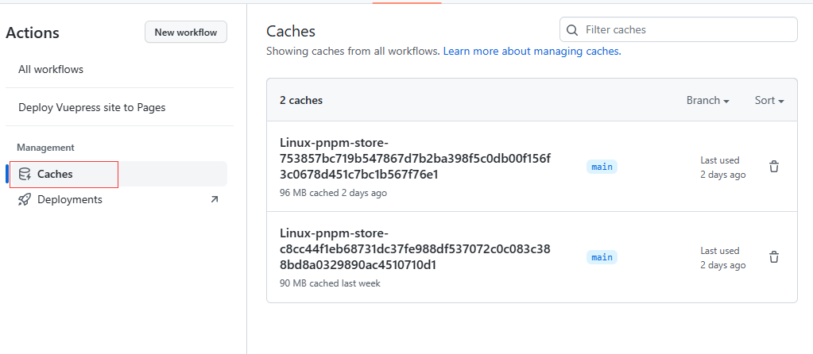
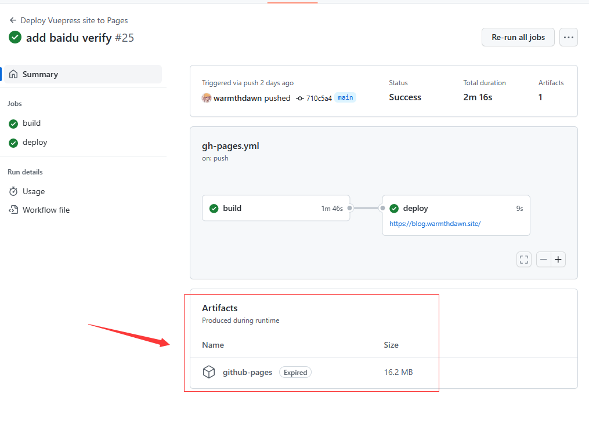
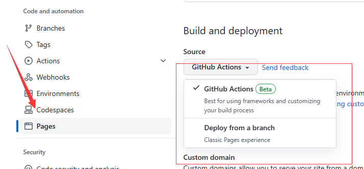

# Github Actions 的N+1种用法

## 什么是 Github Actions

Github Actions 的[官方文档](https://docs.github.com/zh/actions/learn-github-actions/understanding-github-actions)是这样叙述的：
> GitHub Actions 是一种持续集成和持续交付 (CI/CD) 平台，可用于自动执行生成、测试和部署管道。 您可以创建工作流程来构建和测试存储库的每个拉取请求，或将合并的拉取请求部署到生产环境。

这里的 CI/CD 是什么东西？说人话就是，将开发过程种代码的集成（测试、合码、打包等）、部署和交付这一套流水线自动化。

Github Actions 就是对这一类需求的解决方案之一。简单来说，你可以将它理解成一段运行在 Github 服务器上的简单的脚本，然后依次进行代码检查、单元测试、编译、构建发布等等一系列操作。

同时，Github 官方也提供了一个[脚本市场](https://github.com/marketplace?type=actions)，你可以在这里引用很多 Github 官方和社区编写的针对各种不同场景的脚本，因此，很多情况下你并不需要编写具体的 CI 流程，只需要引用对应的脚本就行。

Github Actions 相对其他 CI 工具，Github 仓库本身的一些功能（如 pages、release等）兼容性更好。此外，它对于公开仓库完全免费、个人私有仓库也拥有每月3000分钟的服务器运行时间。

## Github Actions 的基本概念描述

### workflow.yml 与 Github Actions 的基本结构
上面说过，Github Actions 可以理解为一段段脚本，这个脚本就叫工作流（workflow），他是一个 YAML 格式文件，放置于 `.github/workflows` 目录下，下面是一个最简单的workflow。

```yaml
name: Node.js CI

on:
  push:
    branches: [ "main" ]

jobs:
  build-with-nodejs:
    runs-on: ubuntu-latest

    steps:
    - uses: actions/checkout@v3
    - name: Use Node.js
      uses: actions/setup-node@v3
      with:
        node-version: '14'
        cache: 'npm'
    - run: npm ci
    - run: npm run build --if-present
    - run: npm test
```

Github Actions 的主要组件分别为 workflow、job和step。
一个 yaml 文件就是一个 workflow，它代表一个自动化过程，可以在其中运行多个 jobs。你可以指定它的名字、触发条件等，如上述的 workflow 就会在 *main* 分支有新的提交时触发。更多的配置内容可以参考官方文档。
job 是workflow的组成单元，不同的 job 可能运行在不同的机器上，也因此，job 之间的文件、环境等*不会*直接共享。每一个 job 都会在一个全新的环境下运行。如上述的workflow就包含一个名称为 `build-with-nodejs` 的 job，并且这个 job 是在 ubuntu 环境下运行的。
step 是 job的组成单元，表示这个任务每一步的执行流程，它可以是引用一个别的脚本，也可以是运行一段 shell 指令，它定义在 steps 数组内，数组中的每一个元素代表一个 step，你可以指定它的名字（name, 可选），调用哪个第三方脚本（uses），添加哪些参数（env/with）或者执行一段 shell 指令（run）。

当你写完一个 workflow 之后，你就可以把它放入  `.github/workflows`  目录下，并且在 Github 的 Actions 页面里面看见它了。


## Github Actions 的基本配置
### Workflow 触发条件
workflow 是 Github Action 执行的基本单位，它最重要的配置项就是这个工作流应该在什么实际触发。它可以在某个分支被push或者pull request等 github 的各种事件下触发、也可以手动或定时甚至是被其他工作流触发，你可以在[GitHub Actions 的工作流语法](https://docs.github.com/zh/actions/using-workflows/workflow-syntax-for-github-actions#on)中找到各种条件的具体写法，下面列出一些常见的 workflow 事件：
```yaml
# 在 push 的时候触发
on: push

# 在 dev/* 和 main 分支 push 的时候触发
on:
  push: 
    branches:
      - main
      - dev/*

# 在 main 分支 push 和 收到 pull-request 的时候触发
on:
  push:
    branches:
      - main
  pull_request:
    branches:
      - main

# 在添加了 release-* 的 tag 的时候触发
on:
  push:
    tags:
      - release-*

# 手动（或者通过API）触发
on: workflow_dispach
```

### 环境变量、并发和权限

你可以为每一个 Workflow 指定它运行时的环境变量和它可能用到的权限

```yaml
# 环境变量
env:
  LOG_LEVEL: DEBUG
  SERVER: production

# 并发策略，处于同一个 group 的 job 将不会同时运行，只保证最新的 job 运行
# 当一个 job 开始时，如果有其他同一个组正在运行的 ci，当前 job 将处于 pending 状态。
# 与此同时，他会取消其他处于 pending 状态的 job
concurrency:
  # 这里的表达式只能用 github, 而不能用 env 或者 secrets 等上下文
  group: ${{ github.ref }}
  # 可选，如果指定为 true，则 job 开始的时候不仅会取消 pending 状态的其他 job，也会取消正在运行的 job
  cancel-in-progress: true

# 权限
permissions:
  actions: read
  contents: read|write
  pages: read|write
  pull-requests: read
  status: read|write

# 或者一次性给全部权限
perimissions: read-all|write-all
```

值得注意的是，权限的环境变量和并发的配置也可以分别写在每个job里面

```
# 环境变量
jobs:
  example-job:
    env:
      LOG_LEVEL: DEBUG
      SERVER: production
    concurrency:
      group: foo
```


### job 的基本配置
上面说过，job 是 workflow 的组成单元，一个 workflow 可以有多个 job，这些 job 分别运行在不同的机器上，详细配置可以查看[文档](https://docs.github.com/zh/actions/using-workflows/workflow-syntax-for-github-actions#jobs)这里写出一些常用的 job 参数
```yaml
jobs:
  # job 的 id
  build:
    # job 的名字，用于显示
    name: Build Project
    # 在什么机器上运行
    # 例如 ubuntu-latest, ubuntu-18.04, windows-2019, macos-latest
    # 此外你还可以指定运行的具体 docker 容器，详细参考文档
    runs-on: ubuntu-latest
    # 为 steps 里面的所有 run 步骤指定运行环境（这个同 env 和 permissions，也可以写在 workflow 配置内。
    defaults:
      run:
        shell: bash
    # job 的步骤
    steps:
     - step1
     - step2
  publish:
    name: Publish package
    runs-on: ubuntu-latest
    # 这个 job 执行的条件，其中  ${{ }} 可以省略
    if: ${{ github.event_name == "push" }} 
    # 依赖，表示这个 job 只会在 build 完成之后才会执行，如不指定则同时开始
    # 多个依赖可以写数组： needs: [jobA, jobB]
    needs: build
    steps:
     - step1
     - step2
```
### job 的矩阵策略
除了上面说明的一些配置外，job 还有个很有趣的配置项：矩阵策略，这个东西很好理解，就是同时执行很多个相似的 job，例如下面的配置，就是分别在三个不同版本的 node 环境下编译项目，执行 workflow的时候，会同时运行三个 job
```yaml
jobs:
  example_matrix:
    strategy:
      matrix:
        version: [10, 12, 14]
    steps:
      - uses: actions/setup-node@v3
        with:
          node-version: ${{ matrix.version }}
```
既然是矩阵，当然也可以是多维的，那就排列组合：分别在不同的操作系统和不同的 node 环境下编译项目：
```yaml
jobs:
  example_matrix:
    strategy:
      matrix:
        os: [ubuntu-latest, windows-latest]
        version: [10, 12, 14]
    runs-on: ${{ matrix.os }}
    steps:
      - uses: actions/setup-node@v3
        with:
          node-version: ${{ matrix.version }}
```

更多矩阵相关配置参考文档：[Using Matrix For Your Jobs](https://docs.github.com/zh/actions/using-jobs/using-a-matrix-for-your-jobs)

### Step 的基本配置
step 表示了每一个 job 需要执行哪些步骤，可以说是控制 Action 具体功能的主要配置项。
```yaml
steps:
  # 使用 actions/checkout 仓库的脚本
- uses: actions/checkout@v3

- name: Use Node.js # 这个 step 的名字是 Use Node.js
  id: setup-node-env # id
  uses: actions/setup-node@v3 # 使用现成脚本
  with: # 为脚本传递参数
    node-version: '14'
    cache: 'npm'
  
  # 另一种step 写法，执行特定 shell 指令
- run: npm ci
- run: npm run build --if-present
- run: npm test
```
更多 step 的写法，将会在下文中介绍。

### workflow 的缓存和构件（artifact）
上文说过，workflow 的每一个 job 都是在一个全新的环境下运行的，因此，每次执行 job 安装环境等都会耗费大量事件，job之间也无法进行相互通信，于是 workflow 有了缓存和构建的机制。

缓存，顾名思义，就是每次 job 运行都需要的一些公共内容，例如，下载的依赖等，缓存是所有 action 公用的，你可以在 Github 页面找到当前仓库使用的缓存，它使用唯一的 key 进行存储（通常回事某个文件的 hash ，如 pnpm-lock）：

而构建的作用域，则是每次 workflow 的运行期间，它通常用于 job 数据的相互传递，或是通过 API 从外部读写，构建会在 workflow 运行后一段时间过期，在过期前你可以通过 API 或者手动下载：



### workflow 的表达式和上下文
在上面的内容中，有人会注意到我们使用了 `${{ }}` 这种写法，你可以在这里使用大部分合法的 javascript 运算符进行表达式运算，并且 workflow 会直接会用表达式的计算结果替换当前位置。此外你还可以在表达式种使用 `contains`, `hashFiles` 等方法，并可以配合 if 条件达成各种效果，具体参考 [Expressions](https://docs.github.com/zh/actions/learn-github-actions/expressions#functions)
例如，本博客部署脚本使用了下面的代码
```yaml {4}
- uses: actions/cache@v3
  name: Setup pnpm cache
  with:
    path: ${{ steps.pnpm-cache.outputs.STORE_PATH }}
    key: ${{ runner.os }}-pnpm-store-${{ hashFiles('**/pnpm-lock.yaml') }}
    restore-keys: ${{ runner.os }}-pnpm-store-
```
`actions/cache` 这个脚本的具体用法会在后文介绍，高亮行表示缓存 key 的表达式，其表现的结果就如上面的图片所示。

当你为某个 step 指定 id 之后，你可以通过 `steps.${ id }.outputs`获取它的输出
```yaml
- id: build-core-cache
  uses: actions/cache@v3
  with:
    path: core/build
    key: ${{ runner.os }}-build-${{ hashFiles("core/**/*.ts") }}

- name: Build
  # 通过 steps.${ id }.outputs.cache-hit 可以获取 cache 是否命中
  if: steps.build-core-cache.outputs.cache-hit != 'true'
  run: ./bin/build-core.sh
```

## 常用的 workflow 脚本

- git 基础操作：`actions/checkout`
  作为一个部署在 Github 上面的 CI，几乎所有 workflow 都需要和 git 打交道。而 `actions/checkout` 就是针对 git 一系列基本操作的封装。
  下面列出了常见的用法，你可以从它的[仓库](https://github.com/actions/checkout)获取更多详情。
```yaml
# 通常情况下，你只需要简单的 use 以下这个脚本，它就会为你自动 checkout 到当前 workflow 运行的分支上（即：${{ github.repository }}）
- uses: actions/checkout@v3

# 你也可以手动指定其他分支
- uses: actions/checkout@v3
  with:
    ref: my-branch

# 可以是其他仓库
- uses: actions/checkout@v3
  with:
    repository: my-org/my-tools

# 如果你在一个 job 里面 use 了多个 checkout，那就是同时 Checkout 多个分支，当然这种情况下你需要为额外的分支指定其他的空目录
- name: Checkout
  uses: actions/checkout@v3
- name: Checkout tools repo
  uses: actions/checkout@v3
  with:
    repository: my-org/my-tools
    # 这个仓库将会放在 ./my-tools 文件夹下
    path: my-tools

# 如果你要 checkout 的仓库是私有仓库，你需要而外为他提供 token
- name: Checkout private tools
  uses: actions/checkout@v3
  with:
    repository: my-org/my-private-tools
    token: ${{ secrets.GH_PAT }} # `GH_PAT` is a secret that contains your PAT
    path: my-tools
```
  此外，`actions/checkout` 默认只会检出最新的 commit （等价于 `git fetch --depth 1`），并且默认不会 clone submodule，也不会额外处理 [Git LFS](https://gitee.com/help/articles/4235)，如果你有其他需求，你可以添加以下参数：
```yaml
# 更改 fetch depth
- uses: actions/checkout@v3
  with:
    # 如果你想 fetch 全部 commit，填 0
    fetch-depth: 2

# 同时 clone 子模块
- uses: actions/checkout@v3
  with:
    # 这里也可以写成 submodules: recursive，这一回递归的处理子模块
    submodules: true

# 允许 Git-LFS
- uses: actions/checkout@v3
  with:
    lfs: true
```

  最后，`actions/checkout` 也会同时配置好相应的 git 环境，你可以在这个 step 之后直接执行各种 git 指令而无需登录等校验
```yaml
on: push
jobs:
  build:
    runs-on: ubuntu-latest
    steps:
      - uses: actions/checkout@v3
      # 你可以在 checkout 之后直接调用 git commit/push 等，不需要登录和添加token
      # 但是，你仍然需要配置一下 username 和 email用于显示 commit 的 author，不然无法 commit
      - run: |
          date > generated.txt
          git config user.name github-actions
          git config user.email github-actions@github.com
          git add .
          git commit -m "generated"
          git push
```

- 运行环境：`actions/setup-xxx`
  当我们把 git 仓库内代码拉下来之后，下一步就是安装运行环境，Github Actions 官方为我们提供了许多不同语言开发环境的安装脚本：
  - [Setup Node.js environment · Actions · GitHub Marketplace](https://github.com/marketplace/actions/setup-node-js-environment)
  - [Setup Java JDK · Actions · GitHub Marketplace](https://github.com/marketplace/actions/setup-java-jdk)
  - [Setup Go environment · Actions · GitHub Marketplace](https://github.com/marketplace/actions/setup-go-environment)
  - [Setup Python · Actions · GitHub Marketplace](https://github.com/marketplace/actions/setup-python)
  - [Setup .NET Core SDK · Actions · GitHub Marketplace](https://github.com/marketplace/actions/setup-net-core-sdk)
  - [Setup Ruby, JRuby and TruffleRuby · Actions · GitHub Marketplace](https://github.com/marketplace/actions/setup-ruby-jruby-and-truffleruby)
  你可以根据需求选择安装脚本，这里以 nodejs 为例。
  通常情况下，你只需要简单指定版本即可，在 `setup-node` 之后，你就可以直接正常运行 node、npm等指令了。
```yaml
steps:
- uses: actions/checkout@v3
- uses: actions/setup-node@v3
  with:
    # 你可以填写 18、18.15.0等格式，具体参考官方文档
    node-version: 18
- run: npm ci
- run: npm test
```
  也支持从 `.nvmrc` 等文件中读取版本
```yaml
- uses: actions/setup-node@v3
  with:
    node-version-file: '.nvmrc'
```
  不少 setup 脚本都是自带缓存的，它不仅可以缓存环境本身，一般也支持缓存依赖：
```yaml
steps:
- uses: actions/checkout@v3
  # 安装 pnpm，如果你使用 npm 或者 yarn 则无需额外处理,setup-node 自带
- uses: pnpm/action-setup@v2
  with:
    # pnpm 版本
    version: 7
    # pnpm/action-setup 有一个选项，可以在安装 pnpm 的同时自动执行 pnpm install, 配置 run_install 选项即可，但是我们一般不使用这个选项，默认留空就行，因为缓存的配置在下面，如果在这里执行 install 不会命中缓存。
    # run_install: null
- uses: actions/setup-node@v3
  with:
    node-version: 18
    # 开启缓存，可选的选项有 npm、pnpm、yarn
    # 一般我们使用它自带的缓存就足够了，更多缓存的配置方式参考下文。
    cache: 'pnpm'
  # 这是一个比较推荐的写法，可以在构建的同时顺便检查 lockfile 有没有问题，因为我们是通过 pnpm-lock.yaml 来作为缓存的的 key 之一的，如果 lockfile 不正确缓存有可能会存在问题。
  # 同样的道理，如果你使用其他包管理器，推荐 yarn install --immutable 和 npm ci
- run: pnpm install --frozen-lockfile
- run: pnpm test
```
  也支持同时缓存多个项目的依赖（monorepos）
```yaml
steps:
- uses: actions/checkout@v3
- uses: actions/setup-node@v3
  with:
    node-version: '14'
    cache: 'npm'
    # 也可以直接写 blob
    # cache-dependency-path: '**/package-lock.json'
    cache-dependency-path: |
      server/app/package-lock.json
      frontend/app/package-lock.json
- run: npm ci
- run: npm test
```
- 缓存：`actions/cache`
  其实我们已经在各种场景下提到缓存了，如果你觉得自带的缓存不够用的话，Github Actions 官方也提供了自己操作缓存的脚本。
  > 值得一提的是，默认情况下 Github 允许免费使用的缓存大小为 500mb

下面的例子演示了如何使用 `actions/cache` 实现和上文相同效果的 pnpm 依赖缓存
```yaml
- uses: actions/setup-node@v3
  name: 安装 Node.js
  with:
    node-version: 18
- uses: pnpm/action-setup@v2
  name: 安装 pnpm
  with:
    version: 7

  # 首先，我们需要获取 pnpm 缓存路径，这可以通过 pnpm store path 这个指令获取
- name: Get pnpm store directory
  # 设置 id, 从而我们可以在后面引用这个 step
  id: pnpm-cache
  shell: bash
  # 把 STORE_PATH=$(pnpm store path) 输出到 $GITHUB_OUTPUT 内，这样我们可以在后面的 step 里面访问这个结果
  run: |
    echo "STORE_PATH=$(pnpm store path)" >> $GITHUB_OUTPUT

  # 使用 actions/cache 这个脚本
  # 通常你需要指定三个参数，具体描述如下
- uses: actions/cache@v3
  name: Setup pnpm cache
  with:
    # 通过 step.${ id }.outputs.${ key }，我们可以获取之前 step 的输出
    # 从而把 pnpm 缓存路径作为 cache 的输入之一填上
    # 路径支持 glob 写法
    path: ${{ steps.pnpm-cache.outputs.STORE_PATH }}
    # 缓存的 key，通过操作系统和 lockfile 的 hash 生成，这是推荐的做法，当然你可以使用其他的 key， 例如在其中添加 node 的版本等
    key: ${{ runner.os }}-pnpm-store-${{ hashFiles('**/pnpm-lock.yaml') }}
    # 一个数组，表示一组 key 的前缀，当一个缓存无法命中的时候，会寻找匹配这个前缀的别的旧缓存代替
    restore-keys: |
      ${{ runner.os }}-pnpm-store-

  # 后面直接普通的 pnpm install 即可
- name: Install dependencies
  run: pnpm install --frozen-lockfile
```

  同样的道理，我们也可以尝试缓存我们自己文件，下面的脚本将会对 ./build 和 ./src/generated 文件夹进行缓存，把 `actions/cache` 放在编译之前就行。
```yaml
- uses: actions/cache@v3
  with:
    path: |
      build
      src/generated
    # key 我们直接用运行环境吧（其实没啥必要，因为大部分情况下我们都直接用 ubuntu(跑)
    key: ${{ runner.os }}-build-cache
    # restore-keys 不需要了，因为我们的 key 不会变
```

  如果我们直接使用 `actions/cache`，在运行 workflow 的时候，你会发现实际上它执行了两个 step， 在我们定义的其他 step 执行完成只会，github 还会执行一个 post-cache 来重新写入缓存，所以我们通常情况下不需要考虑缓存的读写时机，当然如果你想的话，可以自定义它们。
```yaml
jobs:
  build:
    runs-on: ubuntu-latest

    steps:
    - uses: actions/checkout@v3

      # 尝试恢复缓存
    - name: Restore cached Primes
      id: cache-primes-restore
      uses: actions/cache/restore@v3
      with:
        path: |
          path/to/dependencies
          some/other/dependencies
        key: ${{ runner.os }}-primes

    # todo: 其他 workflow 的step

      # 尝试写缓存
    - name: Save Primes
      id: cache-primes-save
      uses: actions/cache/save@v3
      with:
        path: |
          path/to/dependencies
          some/other/dependencies
        # 这里读取了上面 step 的输出，这样可以确保缓存的 key 一致，避免因为中途文件被修改造成的奇奇怪怪的问题，当然在这个场景下也可以直接写成 ${{ runner.os }}-primes，因为它不会随意改变 
        key: ${{ steps.cache-primes-restore.outputs.cache-primary-key }}
```

  你可以读取 cache 脚本的输出，从而获取 cache 是否命中
```yaml
- id: build-core-cache
  uses: actions/cache@v3
  with:
    path: core/build
    key: ${{ runner.os }}-build-${{ hashFiles("core/**/*.ts") }}

- name: Build
  # 通过 steps.${ id }.outputs.cache-hit 可以获取 cache 是否命中
  if: steps.build-core-cache.outputs.cache-hit != 'true'
  run: ./bin/build-core.sh
```
  更多 cache 相关的内容，参考
  [actions/cache: Cache dependencies and build outputs in GitHub Actions](https://github.com/actions/cache)
  [Caching dependencies to speed up workflows - GitHub Docs](https://docs.github.com/en/actions/using-workflows/caching-dependencies-to-speed-up-workflows)
  
- 构件：`actions/upload-artifact` 和 `actions/download-artifact`
  构件（artifact）的概念我们之前提到过了，想要在 actions 里面操作它其实很简单：
```yaml
  # 上传构件
- uses: actions/upload-artifact@v3
  with:
    # 构件的名字，因为构件是在每次执行过程中所有 job 同步的，多个同名构件只会保留最后一个
    name: my-artifact
    # 构件路径，可以是文件、文件夹、列表、glob
    path: path/to/artifact/ # or path/to/artifact  
    # 过期时间，默认 90 天
    retention-days: 5
```

```yaml
  # 下载构件
- uses: actions/download-artifact@v2
  with:
    name: my-artifact
    path: path/to/artifact/
```

  大部分情况下，其实我们并不需要使用构件，因为一个 job 已经足够完成大部分工作，不过，构件允许你将多个任务分开成不同的 job，虽然一定程度来说有点浪费计算资源，但是这可以让构建过程更加清晰，同时也能允许你在不同的环境下编译不同的版本，然后统一部署/发布。
  参考：
  [Upload a Build Artifact · Actions · GitHub Marketplace](https://github.com/marketplace/actions/upload-a-build-artifact)
  [Download a Build Artifact · Actions · GitHub Marketplace](https://github.com/marketplace/actions/download-a-build-artifact)

- Pages：`actions/deploy-pages` 和  `peaceiris/actions-gh-page`
  Github Pages 是 github 一个有趣的功能之一，关于 pages 有很多资料，这里就不赘述了，在本文中将主要介绍 github pages 与 Github Action 有关的联动。即，如何通过 Github Action 来部署 pages 页面。

  要部署 Github Pages，首先我们需要进入仓库的设置，找到 pages 项目，在下图所示的选项中开启 Pages，你会发现 github 为我们提供了两种部署 Pages 的方式：基于分支的和基于 Action 的。
  
  第二种基于分支的部署方式很好理解，我们只需要将静态的 html 页面放入指定分支就行，你可以使用之前提到的 `actions/checkout` 脚本，配合 git push 等方式手动操作，也可以用一些第三方脚本，例如 peaceiris/actions-gh-page`
```yaml
jobs:
  deploy:
    runs-on: ubuntu-latest
    permissions:
      contents: write
    steps:
      - uses: actions/checkout@v3

      # TODO: build static html

      - name: Deploy
        uses: peaceiris/actions-gh-pages@v3
        with:
          # 这里的 ${{ secrets.GITHUB_TOKEN }} 并不是你手动指定的其他 token，而是 github action 内置的参数之一，这个 token 的权限由上面的 permissions 配置决定
          github_token: ${{ secrets.GITHUB_TOKEN }}
          # 需要部署的目录
          publish_dir: ./public
```
  用上面这种方式部署的 pages，会额外再触发一次 github 内置的 pages 部署任务，并且会额外再项目中添加一个独立的分支和很多额外的 commit，我们可以用 Action 的方式部署 Pages。
  在设置里面将 Pages 的部署方式改成 Actions 之后，我们可以通过下面的脚步部署 Pages（下面是本博客的部署脚本简化）：
```yaml
name: Deploy to Pages
on:
  push:
    branches: ["main"]
  workflow_dispatch:

# 只需要部署最新的 page，前面的可以取消
concurrency:
  group: page-deploy-job
  cancel-in-progress: true

jobs:
# Build job
  build:
    runs-on: ubuntu-latest
      steps:
      - uses: actions/checkout@v3
        # 编译静态页面
      - uses: actions/setup-node@v3
          with:
            node-version: 18
            cache: 'pnpm'
      - uses: pnpm/action-setup@v2
      - run: pnpm install --frozen-lockfile
      - name: Build
      - run: pnpm run docs:build

        # 通过 Action 方式部署 Pages，你需要上传 Artifact，可以直接用 actions/upload-pages-artifact 这个脚本
      - name: Upload artifact
        uses: actions/upload-pages-artifact@v1
        with:
          path: ./blog/.vuepress/dist

# Deployment job
  deploy:
    # 部署 Pages 需要额外的权限
    permissions:
      pages: write      # to deploy to Pages
      id-token: write   # to verify the deployment originates from an appropriate source

    # 需要指定环境
    environment:
      name: github-pages
      url: ${{ steps.deployment.outputs.page_url }}
    
    runs-on: ubuntu-latest
    # 必须在 build 完成之后才开始 pages 部署
    needs: build
    steps:
      - name: Deploy to GitHub Pages
        # id 需要和 上面 environment.url 里面一致
        id: deployment
        uses: actions/deploy-pages@v1
```

  参考：
  [Deploy GitHub Pages site · Actions · GitHub Marketplace](https://github.com/marketplace/actions/deploy-github-pages-site)
  [GitHub Pages action · Actions · GitHub Marketplace](https://github.com/marketplace/actions/github-pages-action)

- Releases:  `ncipollo/release-action`
  Github 官方并没有提供自动发布 release 的脚本，但是有很多第三方脚本支持这一功能
```
name: Releases

on:
  push:
    tags:
      - "*"

jobs:
  build:
    runs-on: ubuntu-latest
    permissions:
      contents: write
    steps:
      - uses: actions/checkout@v2
      - uses: ncipollo/release-action@v1
        with:
          artifacts: "release.tar.gz,foo/*.txt"
          bodyFile: "body.md"
          token: ${{ secrets.YOUR_GITHUB_TOKEN }}
```
  具体方法就不赘述了，可以参考脚本的文档：
  [release-action](https://github.com/ncipollo/release-action/blob/main/README.zh-Hans.md)
- 自动关闭 issue：`actions/stale`
  一个 issue 长时间无人响应，通过机器人自动关闭，可能很多人见过这种效果，这可以很容易的通过 Github Actions 实现：
```yaml
name: 'Close stale issues and PRs'
on:
  # 定时执行 Workflow
  schedule:
    - cron: '30 1 * * *'

# 需要给 Action 操作 issue 和 pr 的权限
permissions:
  contents: write # only for delete-branch option
  issues: write
  pull-requests: write

jobs:
  stale:
    runs-on: ubuntu-latest
    steps:
      - uses: actions/stale@v7
        with:
          # issue 被标记为 stale 时候机器人的消息
          stale-issue-message: 'This issue is stale because it has been open 30 days with no activity. Remove stale label or comment or this will be closed in 5 days.'
          # pr 被标记为 stale 时候机器人的消息
          stale-pr-message: 'This PR is stale because it has been open 45 days with no activity. Remove stale label or comment or this will be closed in 10 days.'
          # 机器人关闭 issue 时候的消息
          close-issue-message: 'This issue was closed because it has been stalled for 5 days with no activity.'
          # 机器人关闭 pr 时候的消息
          close-pr-message: 'This PR was closed because it has been stalled for 10 days with no activity.'
          # 超时时间
          days-before-issue-stale: 30
          days-before-pr-stale: 45
          days-before-issue-close: 5
          days-before-pr-close: 10
          # 也可以不区分 issue 和 pr, 写一起
          # days-before-stale: 30
          # days-before-close: 5
```
  更多配置参考 [actions/stale: Marks issues and pull requests that have not had recent interaction (github.com)](https://github.com/actions/stale)

- 自定义脚本: `actions/github-script` 
  如果你找不到满足自己需求的脚本，你也可以实现自己的脚本，开一个新的仓库并且根据相应文档当然是一种选择，但是如果我们只需要一些简单的需求呢？除了直接使用 run 执行 shell 指令，我们还可以使用 `actions/github-script`，以 JavaScript 脚本的方式，调用 Github Actions 内部的一些 API。

  你可以直接在 scripts 中调用 github 的 [Rest API](https://octokit.github.io/rest.js/)
```yaml
# 在 issue 创建的时候自动评论
on:
  issues:
    types: [opened]

jobs:
  comment:
    runs-on: ubuntu-latest
    steps:
      - uses: actions/github-script@v6
        with:
          # 直接在这里写 javascript 脚本就行，actions/github-script 已经自动引入了 @octokit/rest 并且实例化为 github 对象
          # 例如这里，提交评论
          script: |
            github.rest.issues.createComment({
              issue_number: context.issue.number,
              owner: context.repo.owner,
              repo: context.repo.repo,
              body: '👋 Thanks for reporting!'
            })
```

  脚本的返回值可以通过 outputs.result 获取（其实  `echo result=${ xxx } >> $GITHUB_OUTPUT`  也是一样的）
```yaml
- uses: actions/github-script@v6
  id: set-result
  with:
    script: return "Hello!"
    result-encoding: string
- name: Get result
  run: echo "${{steps.set-result.outputs.result}}"
```

  如果你相传递参数，可以用环境变量
```yaml
steps:
  - uses: actions/github-script@v6
    env:
      FIRST_NAME: Mona
      LAST_NAME: Octocat
    with:
      script: |
        const { FIRST_NAME, LAST_NAME } = process.env
        console.log(`Hello ${FIRST_NAME} ${LAST_NAME}`)
```

  你还可以直接让这个 job 执行失败：
  （其实，更简单的方案是`run: exit 0`，不过下面的写法可以提供失败的原因。
```yaml
steps:
  - uses: actions/github-script@v6
    if: ${ 某些条件 }
    with:
      script: |
        core.setFailed(`Action failed with error ${err}`);

```
  更多用法，可以参考官方文档：[actions/github-script: Write workflows scripting the GitHub API in JavaScript](https://github.com/actions/github-script)

- 为 Pull Request 进行代码检查
  其实这个需求并不需要使用某些特别的脚本，只需要让某个 workflow 由 pull_request 事件触发即可，当这个 workflow 执行失败的时候，将会阻塞 pullrequest 的合入，你只需要让检查的脚本，在不满足要求的时候 exit 0 就可以达到对应的需求了。
## 总结

Github Actions 本身非常强大，它与 Github 的各种功能深入的联动，可以很好的方便我们的开发，构建。